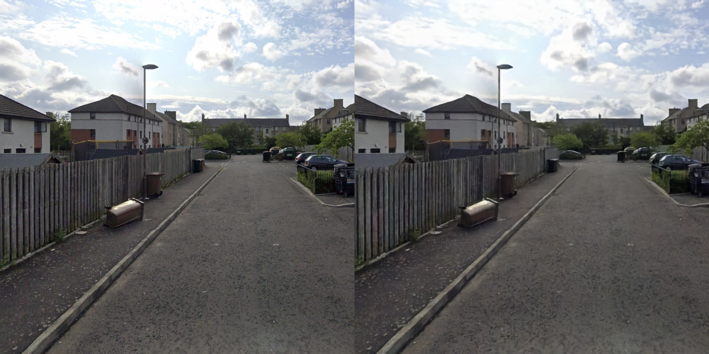
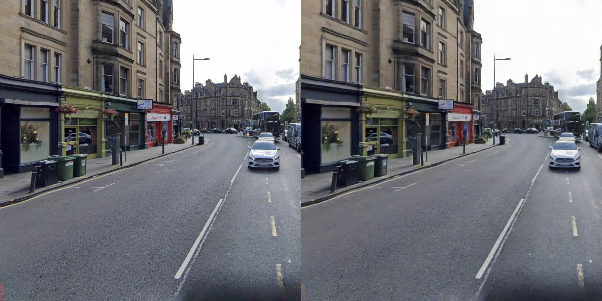

# VQ-VAE-2

Torch implementation of my original [mlx vqvae-2](https://github.com/deboradum/mlx-vqvae2) implementation. I created this torch version because the mlx version had some bugs when scaling up the model.

_Left: original image. Right: VQVAE reconstructed image_
